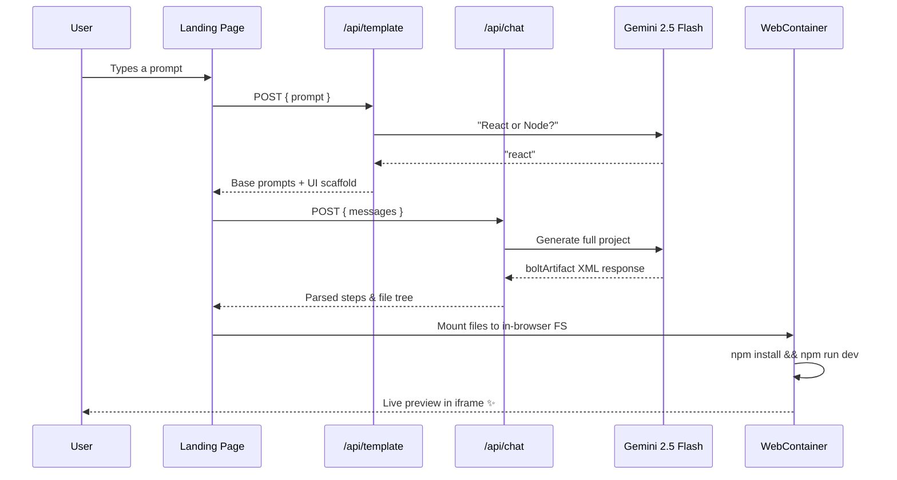

<div align="center">

# ⚡ BlinkBuild

### _Describe it. Generate it. Ship it — all from your browser._

An AI-powered website generator that turns natural language prompts into production-ready, live-previewed web applications in seconds — powered by **Gemini 2.5 Flash** and **WebContainers**.

<br/>

[](https://nextjs.org/)
[](https://www.typescriptlang.org/)
[](https://react.dev/)
[](https://ai.google.dev/)
[](https://tailwindcss.com/)
[](https://webcontainers.io/)
[](https://www.docker.com/)
[](LICENSE)

<br/>

[✨ Features](#-features) · [🛠️ Tech Stack](#️-tech-stack) · [📦 Project Structure](#-project-structure) · [🚀 Getting Started](#-getting-started) · [💻 Usage](#-usage) · [🤝 Contributing](#-contributing)

</div>

---

## ✨ Features

- **🤖 AI-Powered Code Generation** — Generates complete, production-ready React or Node.js projects from plain English descriptions using Google's Gemini 2.5 Flash model.
- **🌐 In-Browser Execution** — Runs a full Node.js dev environment entirely inside the browser via [WebContainers](https://webcontainers.io/) — zero backend servers, zero cloud VMs.
- **👁️ Instant Live Preview** — Preview your generated website in a real embedded iframe with a live dev server — see it the moment it's built.
- **📝 Integrated Code Editor** — View and inspect generated source code in a Monaco Editor (the engine behind VS Code) with full syntax highlighting.
- **📂 Interactive File Explorer** — Navigate the generated project's file tree with collapsible folders, language-aware icons, and one-click file selection.
- **💬 Iterative Refinement via Chat** — Don't like something? Send follow-up prompts to tweak, extend, or restyle your website conversationally.
- **📥 One-Click Export** — Download the entire generated project as a bundled file, ready to run locally or deploy to any host.
- **🎨 Premium Glassmorphism UI** — Stunning dark-mode interface with floating orbs, gradient effects, animated transitions, and micro-interactions throughout.
- **⚡ Smart Template Detection** — AI automatically decides whether to scaffold a React or Node.js project based on the user's intent.
- **🔒 Secure by Default** — COOP/COEP headers pre-configured for WebContainer compatibility across all deployment targets.

---

## 📸 Screenshots / Demo

<div align="center">

> _Screenshots and demo GIFs coming soon!_

| Landing Page | Generation Workspace |
|:---:|:---:|
|  |  |

<!-- 
Replace the placeholder URLs above with actual screenshots:
- `docs/screenshots/landing.png`  — Hero section with prompt input
- `docs/screenshots/workspace.png` — Generation workspace (file tree + editor + preview)
-->

🎥 **Live Demo:** [Coming Soon](#)

</div>

---

## 🛠️ Tech Stack

| Layer | Technology | Purpose |
|:------|:-----------|:--------|
| **Framework** | [Next.js 16](https://nextjs.org/) | App Router, Server Actions, Turbopack |
| **Language** | [TypeScript 5](https://www.typescriptlang.org/) | End-to-end type safety |
| **UI Library** | [React 19](https://react.dev/) | Component rendering |
| **AI Model** | [Gemini 2.5 Flash](https://ai.google.dev/) | Code generation & prompt analysis |
| **Browser Runtime** | [WebContainers API](https://webcontainers.io/) | In-browser Node.js environment |
| **Code Editor** | [Monaco Editor](https://microsoft.github.io/monaco-editor/) | Syntax-highlighted code viewer |
| **UI Components** | [shadcn/ui](https://ui.shadcn.com/) + [Radix UI](https://www.radix-ui.com/) | Accessible, composable primitives |
| **Styling** | [Tailwind CSS 4](https://tailwindcss.com/) | Utility-first CSS |
| **Icons** | [Lucide React](https://lucide.dev/) | Beautiful open-source icons |
| **HTTP Client** | [Axios](https://axios-http.com/) | API requests |
| **Containerization** | [Docker](https://www.docker.com/) | Multi-stage Alpine-based builds |

---

## 📦 Project Structure

```
BlinkBuild/
│
├── app/                            # Next.js App Router
│   ├── page.tsx                    # Landing page — hero + prompt form
│   ├── layout.tsx                  # Root layout (Geist fonts, metadata)
│   ├── actions.ts                  # Server Action — redirect to /generate
│   ├── globals.css                 # Global styles & CSS variables
│   │
│   ├── generate/                   # Generation workspace
│   │   ├── page.tsx                # Suspense wrapper
│   │   └── generation-content.tsx  # Core UI: steps, editor, preview, chat
│   │
│   ├── api/                        # API Routes
│   │   ├── template/route.ts       # POST — AI selects React vs Node scaffold
│   │   ├── chat/route.ts           # POST — Gemini multi-turn code generation
│   │   └── gemini/route.ts         # POST — Streaming Gemini endpoint (Edge)
│   │
│   └── lib/                        # Shared logic
│       ├── prompt.ts               # System prompts & instruction templates
│       ├── steps.ts                # boltArtifact XML → Step[] parser
│       ├── constants.ts            # WORK_DIR, allowed HTML elements
│       ├── stripindents.ts         # Template literal dedent utility
│       └── defaults/
│           ├── react.ts            # React + Vite starter scaffold
│           └── node.ts             # Node.js starter scaffold
│
├── components/                     # React components
│   ├── CodeEditor.tsx              # Monaco Editor wrapper (read-only)
│   ├── FileExplorer.tsx            # Recursive file tree browser
│   ├── PreviewFrame.tsx            # WebContainer → iframe live preview
│   └── ui/                         # shadcn/ui primitives
│       ├── badge.tsx
│       ├── button.tsx
│       ├── card.tsx
│       ├── label.tsx
│       ├── progress.tsx
│       ├── scroll-area.tsx
│       ├── tabs.tsx
│       └── textarea.tsx
│
├── hooks/
│   └── useWebcontainers.ts         # Singleton WebContainer boot hook
│
├── lib/
│   └── utils.ts                    # cn() — clsx + tailwind-merge helper
│
├── public/                         # Static assets (SVGs, favicon)
├── DockerFile                      # Multi-stage production build
├── docker-compose.yml              # Compose config (1 CPU, 1 GB RAM limit)
├── vercel.json                     # COOP/COEP headers for WebContainers
├── next.config.ts                  # Standalone output + security headers
├── tailwind.config.js              # Tailwind configuration
├── tsconfig.json                   # TypeScript config
├── components.json                 # shadcn/ui configuration
└── package.json                    # Dependencies & scripts
```

---

## 🚀 Getting Started

### Prerequisites

| Tool | Version | Notes |
|:-----|:--------|:------|
| **Node.js** | ≥ 20.x | [Download](https://nodejs.org/) |
| **npm** | ≥ 9.x | Bundled with Node.js |
| **Gemini API Key** | — | [Get a free key](https://aistudio.google.com/apikey) |
| **Docker** _(optional)_ | ≥ 24.x | Only for containerized deployment |

### Step 1 — Clone the Repository

```bash
git clone https://github.com/SinghalSahab/BlinkBuild.git
cd BlinkBuild
```

### Step 2 — Install Dependencies

```bash
npm install
```

### Step 3 — Configure Environment Variables

Create a `.env.local` file in the project root:

```env
# .env.local
# ─────────────────────────────────────────────
# Required: Google Gemini API key
API_KEY=your_gemini_api_key_here
```

> [!TIP]
> You can get a free Gemini API key at [aistudio.google.com/apikey](https://aistudio.google.com/apikey).

### Step 4 — Start the Dev Server

```bash
npm run dev
```

Open **[http://localhost:3000](http://localhost:3000)** in your browser. 🎉

> [!IMPORTANT]
> WebContainers require these HTTP headers to function. They are **already configured** in `next.config.ts` and `vercel.json`:
> ```
> Cross-Origin-Embedder-Policy: require-corp
> Cross-Origin-Opener-Policy: same-origin
> ```

---

## 💻 Usage

### Running in Development

```bash
# Start with Turbopack (fast HMR)
npm run dev

# Lint the codebase
npm run lint
```

### Building for Production

```bash
# Create an optimized production build
npm run build

# Start the production server
npm run start
```

### Docker Deployment

```bash
# Build and run with Docker Compose
docker compose up -d --build

# Or build and run manually
docker build -t blinkbuild .
docker run -p 3000:3000 -e API_KEY=your_gemini_api_key blinkbuild
```

> The Dockerfile uses a **3-stage build** (deps → builder → runner) with Next.js standalone output for a minimal image size (~150 MB).

### Vercel Deployment

[](https://vercel.com/new/clone?repository-url=https://github.com/SinghalSahab/BlinkBuild&env=API_KEY&envDescription=Google%20Gemini%20API%20Key&envLink=https://aistudio.google.com/apikey)

```bash
# Or deploy via CLI
npx vercel --prod
```

Set `API_KEY` in your Vercel project's **Settings → Environment Variables**.

### How It Works



---

## 🤝 Contributing

Contributions, issues, and feature requests are warmly welcome!

### How to Contribute

1. **Fork** the repository
2. **Create** your feature branch
   ```bash
   git checkout -b feature/your-amazing-feature
   ```
3. **Commit** your changes with a descriptive message
   ```bash
   git commit -m "feat: add your amazing feature"
   ```
4. **Push** to your branch
   ```bash
   git push origin feature/your-amazing-feature
   ```
5. **Open** a Pull Request against `main`

### Guidelines

- Follow existing code style and conventions
- Write meaningful commit messages ([Conventional Commits](https://www.conventionalcommits.org/) preferred)
- Test your changes locally before submitting
- Keep PRs focused — one feature or fix per PR

> [!NOTE]
> Not sure where to start? Check out the [open issues](https://github.com/SinghalSahab/BlinkBuild/issues) or suggest a new feature!

---

## 📝 License

This project is licensed under the **MIT License**. See the [LICENSE](LICENSE) file for details.

```
MIT License — Copyright (c) 2025 Prakhar Singhal
```

---

<div align="center">

### 🙏 Acknowledgments

[Bolt.new](https://bolt.new/) — Inspiration for AI-powered dev workflows  ·  [StackBlitz](https://stackblitz.com/) — WebContainers technology  ·  [Vercel](https://vercel.com/) — Next.js & hosting  ·  [Google AI](https://ai.google.dev/) — Gemini models

---

**Built with ⚡ by [Prakhar Singhal](https://github.com/SinghalSahab)**

If this project helped you, consider giving it a ⭐ — it means a lot!

</div>