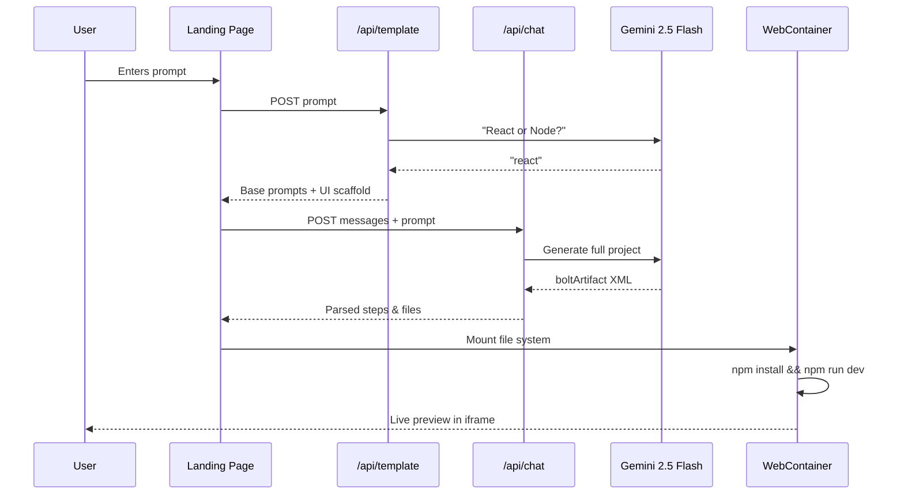

<](https://nextjs.org/)
[](https://www.typescriptlang.org/)
[](https://ai.google.dev/)
[](https://tailwindcss.com/)
[](https://www.docker.com/)

**Describe your vision in plain English. BlinkBuild architects the perfect website — production-ready code, beautiful design, live preview — all in your browser.**

[Getting Started](#-getting-started) · [Features](#-features) · [Architecture](#-architecture) · [Deployment](#-deployment)

</div>

---

## ✨ Features

- **🤖 AI Code Generation** — Powered by Google's Gemini 2.5 Flash model to generate complete, production-ready React or Node.js projects from natural language prompts
- **🌐 In-Browser Execution** — Uses [WebContainers](https://webcontainers.io/) to run a full Node.js environment directly in the browser — no server needed
- **👁️ Live Preview** — Instantly preview your generated website in a live iframe with a real dev server running in-browser
- **📝 Built-in Code Editor** — Integrated Monaco Editor (VS Code's editor) for viewing generated source code with syntax highlighting
- **📂 File Explorer** — Browse the generated project's file tree with folder expansion, file icons, and language detection
- **💬 Iterative Chat** — Refine your website by sending follow-up prompts to the AI after the initial generation
- **📦 Download Project** — Export the full generated project as a bundled text file
- **🎨 Premium UI** — Glassmorphism design with animated backgrounds, gradient effects, and smooth micro-animations

---

## 🏗️ Architecture

```
BlinkBuild/
├── app/
│   ├── page.tsx                # Landing page with prompt input
│   ├── layout.tsx              # Root layout (Geist fonts)
│   ├── actions.ts              # Server action — redirects to /generate
│   ├── generate/
│   │   ├── page.tsx            # Generation page (Suspense wrapper)
│   │   └── generation-content.tsx  # Core generation UI & logic
│   ├── api/
│   │   ├── template/route.ts   # Gemini decides React vs Node template
│   │   ├── chat/route.ts       # Gemini chat for code generation
│   │   └── gemini/route.ts     # Streaming Gemini endpoint (Edge)
│   └── lib/
│       ├── prompt.ts           # System prompts for the AI
│       ├── steps.ts            # XML parser for boltArtifact actions
│       ├── constants.ts        # Shared constants
│       ├── stripindents.ts     # Utility for template literals
│       └── defaults/
│           ├── react.ts        # Default React project scaffold
│           └── node.ts         # Default Node.js project scaffold
├── components/
│   ├── CodeEditor.tsx          # Monaco-based code viewer
│   ├── FileExplorer.tsx        # Tree-view file browser
│   ├── PreviewFrame.tsx        # WebContainer live preview iframe
│   └── ui/                     # shadcn/ui components
├── hooks/
│   └── useWebcontainers.ts     # Singleton WebContainer boot hook
├── lib/
│   └── utils.ts                # cn() utility (clsx + tailwind-merge)
├── DockerFile                  # Multi-stage production Docker build
├── docker-compose.yml          # Production compose config
└── vercel.json                 # COOP/COEP headers for WebContainers
```

### How It Works



---

## 🚀 Getting Started

### Prerequisites

- **Node.js** ≥ 20
- **npm** ≥ 9
- A **Google Gemini API key** ([Get one here](https://aistudio.google.com/apikey))

### Installation

```bash
# Clone the repository
git clone https://github.com/SinghalSahab/BlinkBuild.git
cd BlinkBuild

# Install dependencies
npm install

# Set up environment variables
echo "API_KEY=your_gemini_api_key_here" > .env.local
```

### Development

```bash
npm run dev
```

Open [http://localhost:3000](http://localhost:3000) — the app runs with Turbopack for fast HMR.

> [!IMPORTANT]
> WebContainers require specific HTTP headers (`Cross-Origin-Embedder-Policy: require-corp` and `Cross-Origin-Opener-Policy: same-origin`). These are configured automatically in `next.config.ts` and `vercel.json`.

---

## 🐳 Deployment

### Docker

```bash
# Build and run with Docker Compose
docker compose up -d --build

# Or build manually
docker build -t blinkbuild .
docker run -p 3000:3000 -e API_KEY=your_key blinkbuild
```

The Dockerfile uses a multi-stage build (deps → builder → runner) with Next.js standalone output for minimal image size (~150MB).

### Vercel

```bash
# Deploy to Vercel
npx vercel --prod
```

Set the `API_KEY` environment variable in your Vercel project settings. The `vercel.json` is pre-configured with the required COOP/COEP headers.

---

## 🔧 Environment Variables

| Variable  | Required | Description                        |
|-----------|----------|------------------------------------|
| `API_KEY` | ✅       | Google Gemini API key              |

---

## 🛠️ Tech Stack

| Layer        | Technology                                                       |
|--------------|------------------------------------------------------------------|
| Framework    | [Next.js 16](https://nextjs.org/) (App Router, Turbopack)       |
| Language     | [TypeScript 5](https://www.typescriptlang.org/)                 |
| AI Model     | [Google Gemini 2.5 Flash](https://ai.google.dev/)               |
| In-Browser Runtime | [WebContainers API](https://webcontainers.io/)            |
| Code Editor  | [Monaco Editor](https://microsoft.github.io/monaco-editor/)     |
| UI Components| [shadcn/ui](https://ui.shadcn.com/) + [Radix UI](https://www.radix-ui.com/) |
| Styling      | [Tailwind CSS 4](https://tailwindcss.com/)                      |
| Icons        | [Lucide React](https://lucide.dev/)                             |
| Containerization | [Docker](https://www.docker.com/) (multi-stage, Alpine)    |

---

## 📄 License

This project is private and not currently open-sourced.

---

<div align="center">
  <sub>Built with ⚡ by <a href="https://github.com/SinghalSahab">Prakhar Singhal</a></sub>
</div>
]]>
